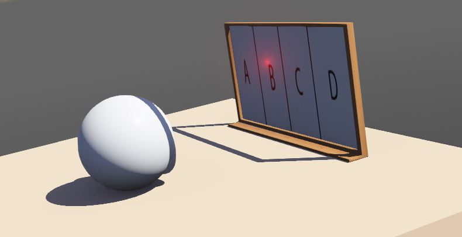

# Smart Laser
A robot that points to the correct answer of a math word problem showed by a camera. The Computer Vision module will detect a paper hold by a person and will convert the frame to text using Optical Character Recognition. The text, including a math problem and four diffrent possible answers, will be sent to the Natural Language Processing module, which will translate the math word problem to a mathematical equation. This equation will then be solved and the result will be sent to the Robotics module that consists of a simulation of a laser pointer that will point to the correct answer out of the four.

## Getting Started

These instructions will get you a copy of the project up and running on your local machine for development and testing purposes.

### Prerequisites

You will need to install:
- Tensorflow Object Detection API
- Tesseract OCR
- Google Cloud Vision API
- PIL
- OpenCV
- Keras
- nltk (and some lines of code that are commented in NLPMathWordProblemSolver.py in the NLP Parsing approach folder)
- Webots
- PyTorch

## Architecture

### Old software architecture
This software is divided in three main modules.

### New software architecture
After adding the DecaNLP module, the software architecture is the following:

### Natural Language Processing module

The NLP module consists of a hybrid model based on Deep Learning, Parsing and Naive Bayes techniques. We first started building a Recurrent Neural Network seq2seq model, built with a GRU Encoder, GRU Decoder and Bahdanau Attention. This model was tested with a broad number of datasets. However, the results were not as accurate as we desired. In order to support the lack of accuracy, we built another approach for the task. This approach consists in the parsing technique. The math word problem will be syntactically analyzed and will detect symbols and numbers from the text and build an equation to solve with the help of a Naive Bayes model classifier, which will classify whether a symbol is positive or negative.

Deep learning Recurrent Neural Network seq2seq model structure:

We first apply number mapping in order to remove the numbers from the problems. This gets us a better training because the sentences have less variation. The inputs go through an embedding layer for vector encoding and purposes and setting all of the inputs with the same length. The inputs go through the encoding layer and get encoded. The attention mechanism assign a weight to the input words and is then used by the decoder to predict the next word in the sentence. The decoder then return the predicctions and the decoder hidden state. We also apply the teacher forcing technique to decide the next input to the decoder, this technique passes the target word as the next input to the decoder.

#### UPDATE:
We have added a whole new NLP module. The module will make the robot perform a larger range of Natural Language Processing Tasks. Before, the robot could solve math word problems with the module we built. Now, with the help of the DecaNLP project, the robot is able to perform 10 tasks more, including some state-of-the-art tasks. These new tasks are the nexts:

Question answering, machine translation, summarization, natural language inference, sentiment analysis, semantic role labeling, relation extraction, goal-oriented dialogue, semantic parsing and pronoun resolution.

These tasks are very diverse and are based on question answering, which suits perfectly with our robot model. Although not all of the tasks are optimal for it because our robot works better with shorter text so the camera can analyze the text better.

Examples of this implementation can be found on the Results section of this Readme.

All of these complex tasks are performed by a single system model. The following figure is the model structure of the Multi Question Answering Model:

### Computer Vision module
The computer vision module consists of,first, using the tensorflow object detection API to detect the existence of the mathematical question paper in the camera scene. Once it is detected, we capture a photo of the paper, save it as an image and use ocr techniques to extract the mathematical question. With the help of the NPL module we calculate the correct answer to the question and then we proceed to locate it and point it within the image. Finally, this module saves the correct answer and its corresponding location in a txt, these data will be used by the Laser Robotics Simulation module.
This module also uses Google Cloud service(Vision API) to perform handwriting recognition for handwritten questions

### Laser Robotics Simulation module

The Laser Robotics module consists on the simulation of the laser itself.
Using the Webots program we created a espherical object that projects a laser over an image. 
We can give exact coordinates for the laser to point to, or we can use some preprogamed coordiantes to point to the corners of the image. 
This image, which can be changed, consist of 4 leters, A B C D, representing the answer options.
We make use of a txt in which the content is provided by the other modules. Said content consists of the answer to the question and the coordinates of it.
When we start the program, laser.py, our controller script, reads the txt file and points to the correct answer printing the answers value and coordinates.

## Testing

You can test this software with the math word problem set of examples in MathWordProblemsToTest.txt
If you want to test the NLP module by its own. You can do it by setting the smartLaserMODE variable to False in NLPMathWordProblemSolver.py and changing the access to the bag of words .txt to /{name_of_file}.txt
We invite you to test this software with some math word problem of your own!

## Results

### NLP results:

### DecaNLP results:

#### Question Answering

#### Machine Translation

#### Summarization

#### Natural Language Inference

#### Sentiment Analysis

#### Semantic Role Labeling

#### Relation Extraction

#### Goal-Oriented Dialogue

#### Semantic Parsing

#### Pronoun Resolution/Commonsense Reasoning

### Laser Robotics Simulation results:

## Authors

* **Daniel Rojas Pérez** - *NLP module* - [Github account](https://github.com/danielrojasperez)
* **Ange Xu** - *CV module* - [Github account](https://github.com/xangeeee)
* **Marcos Muñoz González** - *Laser Robotics Simulation module* - [Github account](https://github.com/marcosmgz95)
* **Roger Piera** - *Laser Robotics Simulation module* - [Github account](https://github.com/RogerPiera)

## License

This project is licensed under the MIT License - see the [LICENSE.md](LICENSE.md) file for details

